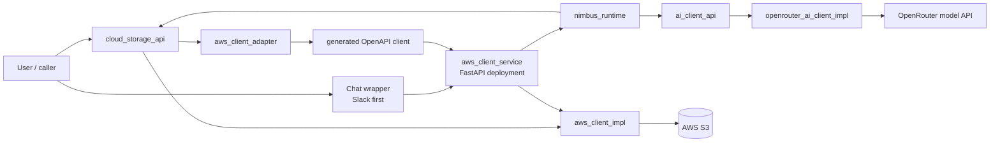
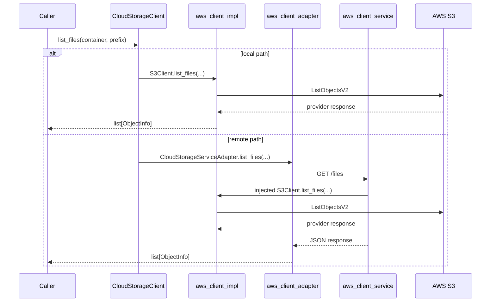
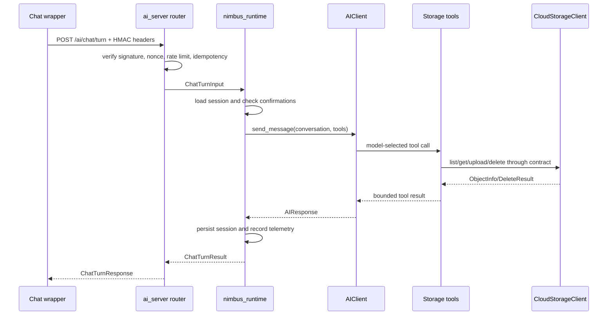

# Nimbus Design Document

**Status:** Current for `hw-3`  
**Last updated:** 2026-04-29  
**Audience:** contributors, reviewers, future maintainers

This document follows the lightweight design-doc shape described in
[Design Docs at Google](https://www.industrialempathy.com/posts/design-docs-at-google/):
context and scope, goals/non-goals, design, alternatives, and cross-cutting
concerns. It records the system decisions behind the code, not every line of
implementation.

## Context and Scope

Nimbus is Team 2's cloud-storage vertical project for OSPSD Spring 2026.

HW2 required turning a local provider implementation into a deployable service
while preserving the original local interface through an adapter:

```text
CloudStorageClient caller
  -> local implementation OR HTTP adapter
  -> same provider-neutral storage contract
```

HW3 adds the intelligent-application layer:

- a provider-neutral AI client contract,
- one concrete AI provider implementation,
- tool calling over the storage domain,
- integration-ready HTTP surface for chat wrappers,
- deployed-system concerns: auth, idempotency, telemetry, and persistent state.

The codebase is therefore two related verticals:

- **Storage vertical:** provider-neutral object storage and HTTP location
  transparency.
- **AI/runtime vertical:** provider-neutral model calls plus chat-safe storage
  tools and session orchestration.

## Goals

- Preserve the `CloudStorageClient` abstraction for both local and remote
  storage callers.
- Keep concrete AWS S3 code isolated in `aws_client_impl`.
- Expose the storage contract through FastAPI and a generated OpenAPI client.
- Add an `AIClient` abstraction with OpenRouter as the current implementation.
- Let the AI use storage through a small, guarded tool surface.
- Keep chat transport logic thin; shared behavior belongs in `nimbus_runtime`.
- Support signed, idempotent wrapper calls for Slack-like frontends.
- Persist AI sessions safely across restarts.
- Emit latency, success, failure, auth, replay, and tool-call telemetry seams.
- Keep tests deterministic by default, with live cloud/provider tests opt-in.
- Keep docs and component READMEs accurate enough for onboarding and review.

## Non-Goals

- Build a general MCP host/client/server stack in HW3.
- Make the Nimbus AI service directly responsible for Slack OAuth or Slack event
  ACK timing. That belongs in a chat-wrapper service.
- Support multi-writer horizontal scaling with the current file-backed state
  store. A shared backend is a future scale trigger.
- Hide destructive actions behind model judgment alone. Destructive operations
  require explicit confirmation.
- Vendor the external `cloud_storage_api` package.
- Hand-edit generated OpenAPI client internals.

## System Context



## Components

| Component | Role | Public API | Key dependencies |
| --- | --- | --- | --- |
| `cloud_storage_api` | External storage contract | `CloudStorageClient`, `ObjectInfo`, `DeleteResult`, domain exceptions | none implementation-specific |
| `aws_client_impl` | Direct AWS S3 implementation | `get_client_impl()`, `S3Client` implementing `CloudStorageClient` | `boto3`, `botocore`, `cloud-storage-api` |
| `aws_client_service` | Deployable FastAPI app | storage HTTP routes, `/openapi.json`, `/auth/...`, `/ai/...`, `/guide/` | FastAPI, `aws-client-impl`, `ai-server` |
| `aws_s3_cloud_storage_service_client` | Generated HTTP client | generated endpoint modules and models | `httpx`, `attrs`, `python-dateutil` |
| `aws_client_adapter` | Remote `CloudStorageClient` implementation | `get_client_impl()`, `CloudStorageServiceAdapter` | generated client, `cloud-storage-api` |
| `ai_client_api` | Provider-neutral AI contract | `AIClient`, `Conversation`, `Tool`, `AIResponse`, AI exceptions | `pydantic` |
| `openrouter_ai_client_impl` | Concrete OpenRouter provider and CLI | `OpenRouterClient`, `OpenRouterConfig`, `nimbus`, storage tools | OpenAI SDK, pydantic-ai, Typer |
| `nimbus_runtime` | Transport-neutral AI/chat orchestration | `NimbusRuntime`, `ChatTurnInput`, `ChatTurnResult`, telemetry | `ai-client-api`, `cloud-storage-api` |
| `ai_server` | Signed HTTP AI router | `/ai/health`, `/ai/chat/turn`, session history/delete routes | FastAPI, `nimbus-runtime` |

## Core Design

### Storage Location Transparency

The same caller contract works for local S3 and remote HTTP-backed storage.



The adapter exists because the generated client is HTTP-shaped, while callers
expect the Python storage contract.

### AI Runtime Path

Chat platforms should not call storage or provider SDKs directly. They send a
normalized, signed turn into the AI service.



### State Ownership

| State | Owner | Storage | Notes |
| --- | --- | --- | --- |
| OAuth browser session handle | `aws_client_service` | Starlette session cookie plus server-side token store | Raw provider tokens stay server-side |
| Storage object data | AWS S3 | S3 bucket/container | Accessed only through `CloudStorageClient` |
| AI conversation history | `nimbus_runtime` / `ai_server.sessions` | Render Postgres in production, JSON files under `AI_SESSION_DIR` locally | Atomic file fallback for tests and local development |
| HMAC nonce/replay state | `ai_server.request_state` | Render Postgres in production, JSON files under `AI_SESSION_DIR/_request_state` locally | Survives service restarts |
| Idempotent response cache | `ai_server.request_state` | Render Postgres in production, JSON files under `AI_SESSION_DIR/_request_state` locally | TTL controlled by env |
| Pending confirmations | `nimbus_runtime` action store | Render Postgres in production, file fallback locally | Expiring destructive-action guard |
| Telemetry | `nimbus_runtime.telemetry` and OpenTelemetry | In-memory test snapshot plus New Relic OTLP export | Stable metric names for dashboards and tests |

### Public Contracts

Storage contract:

- `upload_file(container, local_path, remote_path) -> ObjectInfo`
- `upload_obj(container, file_obj, remote_path) -> ObjectInfo`
- `download_file(container, object_name, file_name) -> ObjectInfo`
- `list_files(container, prefix) -> list[ObjectInfo]`
- `delete_file(container, object_name) -> DeleteResult`
- `get_file_info(container, object_name) -> ObjectInfo`

AI contract:

- `send_message(prompt, tools=None, max_steps=None, dry_run=False, stream=False) -> AIResponse`
- `get_client() -> AIClient` from the interface package after an implementation registers a factory
- `ping() -> bool`
- `on_event(listener) -> None`

HTTP contract:

| Method | Path | Purpose |
| --- | --- | --- |
| `GET` | `/health` | Storage service health |
| `POST` | `/files/{container}/{object_name:path}` | Upload object |
| `GET` | `/files` | List objects |
| `GET` | `/download` | Download object |
| `GET` | `/files/{container}/{object_name:path}/info` | Object metadata |
| `DELETE` | `/files/{container}/{object_name:path}` | Delete object |
| `GET` | `/auth/login` / `/auth/callback` | GitHub OAuth |
| `POST` | `/ai/chat/turn` | Signed chat turn |
| `GET` | `/ai/sessions/{session_id}/history` | Session inspection |
| `DELETE` | `/ai/sessions/{session_id}` | Session deletion |

## Key Decisions and Trade-Offs

### Keep Generated Code Generated

The generated client mirrors OpenAPI. It is useful but not ergonomic domain API.
Domain behavior belongs in `aws_client_adapter`; generated internals are
regenerated when the service contract changes.

Trade-off: regeneration adds workflow overhead, but avoids hand-maintained HTTP
client drift.

### Use Postgres-Backed State for HW3

The current deployment model uses Render Postgres for sessions, idempotency,
nonce replay, in-flight claims, events, actions, and artifacts. Atomic JSON file
writes remain enough for local development and tests, but production state is
shared and durable.

Trade-off: Postgres adds one managed dependency but removes the accidental
single-process deployment assumption. The trigger for Redis/Valkey or queues is
measured hot coordination, action execution that exceeds HTTP deadlines, or
multi-region active-active serving.

### Keep `ai_server` Thin

`ai_server` owns HTTP and request controls. `nimbus_runtime` owns behavior.

Trade-off: more packages and models, but much cleaner reuse for Slack, CLI, or
future chat providers.

### Require Explicit Destructive Confirmation

Deletes are two-step. The system returns a confirmation prompt first and only
executes after the expected reply.

Trade-off: slower UX, but safer and easier to audit.

### Export Telemetry Through OpenTelemetry

Runtime telemetry records counters and histograms in memory for tests and emits
OpenTelemetry metrics/traces for production. New Relic is the HW3 telemetry
backend, with `NIMBUS_TELEMETRY_DASHBOARD_URL` carrying the private dashboard
handoff link in Render/CircleCI secrets.

Trade-off: the metric vocabulary stays vendor-neutral, but the deployment still
depends on a managed New Relic account for the final dashboard.

## Alternatives Considered

| Alternative | Why not chosen |
| --- | --- |
| Put all AI logic in the FastAPI router | Would couple transport, auth, sessions, tools, and prompt policy in one hard-to-test layer |
| Let the chat wrapper call S3 directly | Would duplicate storage policy and bypass the `CloudStorageClient` abstraction |
| Use only the generated HTTP client in app code | Would expose HTTP details instead of preserving the HW1 storage contract |
| Introduce Redis immediately | Adds infrastructure before the current single-writer deployment needs it |
| Expose raw model tool power for deletes | Unsafe; model output alone is not an authorization boundary |
| Build MCP for HW3 | Useful conceptually, but too much host/client/server scope for this sprint |

## Cross-Cutting Concerns

### Security

- No secrets are committed; local secrets live in gitignored `credentials.env`.
- Storage routes use API key or OAuth session auth.
- Chat turns use HMAC signatures with timestamp freshness and nonce replay
  protection.
- Management endpoints use a separate `AI_SERVER_API_KEY`.
- Destructive storage actions require explicit confirmation.
- Tool containers and local safe roots are pinned by configuration, not by model
  prompt text.

### Reliability

- Session writes are atomic.
- Per-session locks serialize concurrent turns for one conversation.
- Idempotency keys prevent duplicate chat turn execution.
- Rate limiting bounds per-user request bursts.
- Provider and transport errors are translated into domain errors or HTTP
  statuses instead of leaking SDK exceptions.
- Transient transport errors against the AI provider
  (`openai.APIConnectionError`, `openai.APITimeoutError`) are retried with
  exponential backoff and jitter inside `openrouter_ai_client_impl` before
  the existing primary→fallback model hop fires. The retry budget is bounded
  by `OPENROUTER_MAX_RETRIES` (default 3) and worst-case adds ~1.5s of
  latency. Auth, rate-limit, HTTP 5xx, and step-budget errors are explicitly
  *not* retried — they map to stronger responses (auth surfaces immediately;
  the others fall back).

### Observability

- Runtime telemetry records wrapper turn outcomes, auth results, replay hits,
  AI latency/failures, tool calls, **token usage** (split by direction
  input/output, labeled by model), and **estimated cost in USD** per response
  for models in the curated pricing table.
- `structlog` is used for structured logging.
- HW3 requires request latency, success rate, and failure rate to be visible in
  deployment; current code provides the application-level seams.
- `AIResponse.cost_usd_estimate` is an optional, approximate USD figure
  derived from the per-model price table in `openrouter_ai_client_impl.pricing`.
  It is a dashboard convenience, not billing truth, and is `None` for models
  that are not in the table.

### Testing

- Unit tests cover local package behavior and error translation.
- Integration tests cover FastAPI plus generated client plus adapter flows.
- E2E tests cover public workflows and deployed paths when credentials are
  provided.
- Property tests cover conversation, auth, rate limit, and session invariants.
- Fuzz harnesses harden corrupted conversation/session/request-state parsing.

## Homework Alignment

HW2 requirements satisfied by this design:

- FastAPI service deployment unit.
- OAuth-capable service boundary.
- OpenAPI-generated client.
- Adapter restoring the original interface.
- `/health` endpoint.
- README and component documentation.
- CI-oriented test/lint/type workflow.

HW3 requirements addressed by this design:

- External AI provider integrated behind `ai_client_api`.
- Tool calling over the cloud-storage domain.
- Shared API/dependency approach for vertical integration.
- Deployed-system shape with secrets, mounted session volume, and health checks.
- Telemetry seams for latency, success, and failure reporting.
- Integration/e2e/property/fuzz coverage for cross-package behavior.

## Open Questions

- Which chat-wrapper repository will own Slack app installation, ACK timing, and
  Slack-specific file fetches long-term?
- What measured workload should graduate synchronous action execution to a
  queue or workflow engine?
- Should generated-client regeneration become a single `just` or `nox` command?
