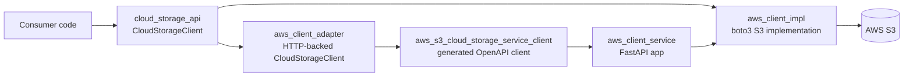
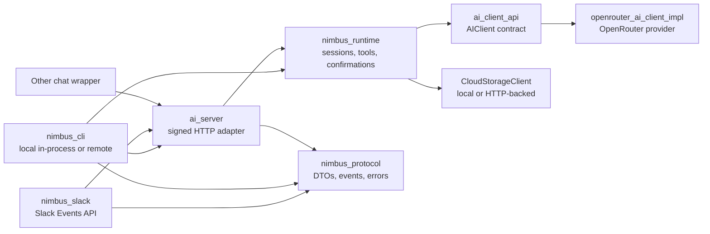

# Nimbus: Cloud Storage and AI Runtime

[](https://dl.circleci.com/status-badge/redirect/gh/2SpaceMasterRace/nimbus/tree/hw-3)
[](https://circleci.com/gh/2SpaceMasterRace/nimbus)
[](https://python.org)
[](https://github.com/astral-sh/ruff)
[](https://nimbus-slack-production.onrender.com/slack/install)
[](https://one.newrelic.com)
[](https://sentry.io/auth/login/)
[](https://logfire.pydantic.dev)
[](https://opentelemetry.io)
[](https://app.launchdarkly.com)

Nimbus is a Python 3.12+ workspace for building cloud-storage-backed AI
applications without coupling product code to one storage provider, one model
provider, or one chat frontend.

The shipped backend is S3: live object operations flow through `aws_client_impl`
and boto3 to AWS S3. The architecture is multi-cloud ready because product code
speaks the external `CloudStorageClient` contract and the service receives
storage through dependency injection. Additional providers (Google Cloud Storage,
Azure Blob, Dropbox, Drive) are not yet shipped; they slot in by implementing
the same contract.

Nimbus exists to make this workflow boring and reusable:

1. Store and inspect objects through a provider-neutral `CloudStorageClient`.
2. Expose that storage contract over HTTP for other services.
3. Let an AI assistant use a small, guarded storage tool surface.
4. Run long-lived storage work as durable tasks with events, actions, and
   artifacts.
5. Serve chat frontends through a signed, idempotent HTTP API.
6. Keep the architecture easy to test, replace, and extend.

If you are new here, start with the quickstart below, then read
[Repository Roadmap](#repository-roadmap) to find the right package.

## Contents

- [Quickstart](#quickstart)
- [See It Work](#see-it-work)
- [Tiny Code Examples](#tiny-code-examples)
- [Repository Roadmap](#repository-roadmap)
- [Architecture](#architecture)
- [Installation and Builds](#installation-and-builds)
- [Run the App](#run-the-app)
- [Run the Docs](#run-the-docs)
- [Test and Quality Commands](#test-and-quality-commands)
- [Environment Variables](#environment-variables)
- [Deployment Notes](#deployment-notes)
- [Troubleshooting](#troubleshooting)

## Quickstart

```shell
git clone git@github.com:2SpaceMasterRace/nimbus.git
cd nimbus
uv sync --all-packages

uv run pytest src/ -q
uv run sphinx-build docs/source docs/build/html
```

Confirm all workspace packages import:

```shell
uv run python -c "import aws_client_impl, aws_client_service, aws_client_adapter, ai_client_api, openrouter_ai_client_impl, nimbus_protocol, nimbus_runtime, nimbus_cli, nimbus_slack, ai_server; print('workspace ok')"
```

Run the local API shell with development secrets:

```shell
SESSION_SECRET_KEY=dev-session-secret \
API_KEY=dev-storage-api-key \
AI_SERVER_API_KEY=dev-ai-api-key \
AI_SERVER_SIGNING_SECRET=dev-wrapper-signing-secret \
uv run uvicorn aws_client_service.main:app --reload
```

Then check:

```shell
curl http://localhost:8000/health
curl http://localhost:8000/ai/health
```

## See It Work

### Slack commands

In Slack (after BYOK setup), Nimbus answers a fixed set of adapter-owned
commands deterministically before the model fallback path:

| Prompt | What it does |
|---|---|
| `@Nimbus what files are in this channel?` | Lists Slack files via `files.list`. |
| `@Nimbus save all files in this channel` | Streams progress via `chat.update`, uploads missing files to S3, records manifest evidence. |
| `@Nimbus save files from #legal and #design` | Saves each mentioned channel and returns one aggregate scanned/saved/skipped/failed report. |
| `@Nimbus which files are missing from S3?` | Compares Slack inventory to the saved manifest. |
| `@Nimbus which files changed since the last sync?` | Reports new and resized Slack files since the last save. |
| `@Nimbus find duplicate files` | Groups current-channel manifest entries by `content_sha256`; flags stale rows. |
| `@Nimbus find duplicate files in my bucket` | Checks all Nimbus-saved Slack manifest rows in the workspace. It does not scan arbitrary S3 uploads outside Nimbus. |
| `@Nimbus status` | Shows a live workspace health card: running tasks, awaiting approval, done today, failed, pending approvals, and proposed plans. |

Add `--profile-timing` anywhere in an `@Nimbus` message to receive a follow-up
Block Kit card with a per-step timing breakdown. Use
`--profile-timings=half|full|hud|waterfall` for richer views: executive budget,
opaque/measured trace table, game-style HUD, or request waterfall. The flag is
stripped before command parsing so it never confuses intent.

Nimbus Slack also runs a scheduled saved-manifest verifier for BYOK workspaces.
Every interval it HEAD-checks Nimbus-saved S3 objects, de-dupes alert issues in
the Slack store, and posts a drift card to the owning channel when a saved
object is missing or has changed size/hash. Tune with
`NIMBUS_SLACK_VERIFIER_ENABLED`, `NIMBUS_SLACK_VERIFIER_INTERVAL_SECONDS`,
`NIMBUS_SLACK_VERIFIER_INITIAL_DELAY_SECONDS`, and
`NIMBUS_SLACK_VERIFIER_MAX_RECORDS`.

Open the **Nimbus App Home tab** in Slack's sidebar for the same live
dashboard automatically refreshed on every visit.

After the first explicit `@Nimbus` mention in a thread, Nimbus accepts
unmentioned follow-up replies in that same thread for the configured follow
window. Enable Slack `message.channels`/`message.groups` events for this mode;
top-level channel chatter is still ignored.

### CLI commands

The Nimbus CLI (`nimbus`) provides a terminal interface for all durable
background work. All commands below work with `uv run nimbus` in the repo or
with `pip install nimbus-cli` if installed stand-alone.

```shell
# Session management
nimbus auth local --openrouter-key "$OPENROUTER_API_KEY"
nimbus chat "Summarize this repo."          # REPL with readline history
nimbus status                               # workspace health summary

# Task management
nimbus task list                            # list recent tasks
nimbus task list --watch                    # live-refresh every 5 s
nimbus task list --watch --interval 10      # custom refresh interval
nimbus task inspect <task-id>              # full task detail + cost/token usage
nimbus task approve <task-id>              # approve a pending task
nimbus task retry <task-id>               # retry a failed task

# Artifact management
nimbus artifact show <artifact-id>         # inspect one artifact by ID
nimbus proof show latest                   # validate the latest proof receipt
nimbus proof show <receipt-id> --json      # machine-readable proof bundle

# Plan management
nimbus plan list --json                    # list recent proposed plans
nimbus plan show <plan-id> --json          # inspect one proposed plan
nimbus plan diff <plan-id>                 # show target, restore story, binding
nimbus plan approve <plan-id>              # approve without executing in-process
nimbus plan reject <plan-id>               # reject and preserve the audit trail
nimbus plan apply <plan-id>                # compatibility alias for approval
nimbus plan cleanup <manifest-artifact-id> --json  # candidate cleanup plans

# Workspace time-travel
nimbus workspace at 2024-06-01T12:00:00Z          # snapshot at a past timestamp
nimbus workspace diff 2024-06-01T00:00:00Z 2024-06-02T00:00:00Z  # delta between two moments

# Protected roots and generations
nimbus root protect --container "$AWS_BUCKET_NAME" --prefix team/
nimbus generation create <root-id> --json          # writes manifest + proof
nimbus generation list --json                      # all snapshots, newest first
nimbus manifest list                               # manifest history view
nimbus generation diff <gen-a> <gen-b> --json      # stable object diff
nimbus blame team/report.csv --json                # provenance by generation
nimbus heal root <root-id> --json                  # verify health + repair advice
nimbus heal replica <source-manifest> --replica-manifest <replica-manifest> --json
nimbus heal replica <source-manifest> --replica-manifest <replica-manifest> \
  --allow-missing-repair --apply --json            # copy missing replicas + receipt

# Manifest drift verification
nimbus verify <artifact-id>                        # short alias
nimbus verify manifest <artifact-id>              # compare manifest against live S3
nimbus verify manifest <artifact-id> --strict     # treat unknown objects as drift

# Storage version control
nimbus stack propose <plan-id> --json       # plan -> ordered storage changes
nimbus stack diff <stack-id> --json         # exact targets and digests
nimbus stack approve <stack-id>             # approval gate before apply
nimbus stack restack <stack-id> --manifest <manifest-artifact-id>
nimbus stack apply <stack-id> --yes --json  # verifier-gated execution

# Learning and replay
nimbus policy patch propose --capability delete_file --json
nimbus policy patch accept <proposal-id> --json
nimbus spec check --json
nimbus trace export <session-id> --json
nimbus trace replay <session-id> --expected trace.json --json

# Provider readiness and health evidence
nimbus provider capabilities --json
nimbus provider health --prefix team/ --json

# Object-backed evidence MVP
nimbus evidence export <artifact-id> --json
nimbus evidence preview <artifact-id> --json
nimbus evidence compact <artifact-id> [<artifact-id> ...] --json

# S3-only migration evidence
nimbus migration evaluate <root-id> \
  --candidate-container "$REPLICA_BUCKET" \
  --candidate-prefix team/ --json
```

The production backend today is S3. Multi-cloud readiness is implemented as
provider-neutral runtime contracts, capability protocols, and fake-provider
contract tests; no non-S3 provider is presented as production-ready.

Run the Nimbus CLI without storage tools:

```shell
export OPENROUTER_API_KEY="sk-or-v1-..."
uv run nimbus auth
uv run nimbus auth local --openrouter-key "$OPENROUTER_API_KEY" --no-aws
uv run nimbus chat "Summarize this repo in one sentence." --profile local --no-tools
```

Example session:

```text
$ uv run nimbus chat "Summarize this repo in one sentence." --profile local --no-tools
Nimbus  profile=local  mode=local  model=openai/gpt-oss-120b:free
Nimbus is a provider-neutral cloud storage and AI runtime workspace with an S3
implementation, FastAPI APIs, an OpenRouter client, and guarded storage tools.
```

The signed AI wrapper route can also be smoke-tested without hand-building HMAC
headers:

```shell
uv run python scripts/ai_server_wrapper_smoke.py \
  --base-url http://localhost:8000 \
  --signing-secret "$AI_SERVER_SIGNING_SECRET" \
  message-event \
  --workspace-id T123TEAM \
  --event-id smoke-001 \
  --channel-id C123CHAN \
  --message-ts 1713840000.123456 \
  --user-id U123USER \
  --text "Hello, Nimbus."
```

## Tiny Code Examples

Use storage through the provider-neutral contract:

```python
from pathlib import Path

from aws_client_impl import get_client_impl

storage = get_client_impl()
info = storage.upload_file(
    container="my-bucket",
    local_path=Path("report.txt"),
    remote_path="reports/report.txt",
)
print(info.object_name, info.size_bytes)
```

Use AI through the provider-neutral contract:

```python
from ai_client_api import Conversation
from openrouter_ai_client_impl.config import OpenRouterConfig
from openrouter_ai_client_impl.openrouter_client import OpenRouterClient

client = OpenRouterClient(OpenRouterConfig.from_env())
conversation = Conversation(system="You are concise.")
conversation.add_user("What can Nimbus do?")

response = client.send_message(conversation)
print(response.text)
```

Call the HTTP-backed storage adapter when your code should talk to the service
instead of boto3 directly:

```python
from aws_client_adapter import get_client_impl

storage = get_client_impl()
for item in storage.list_files("my-bucket", prefix="reports/"):
    print(item.object_name)
```

## Repository Roadmap

| Path | What lives there | Start here when... |
| --- | --- | --- |
| `README.md` | Project overview and quickstart | You are orienting yourself |
| `SYSTEM_DESIGN.md` | Canonical product roadmap, feature handoff, and system design | You are implementing the next product slice |
| `AGENTS.md` | Engineering rules for agents and contributors | You are changing code or docs |
| `CONTRIBUTING.md` | Human contribution workflow and project habits | You are preparing a PR |
| `pyproject.toml` | Workspace, lint, type, test, and docs configuration | You need tooling truth |
| `main.py` | Reference CLI entry point | You want the simplest executable path |
| `src/aws_client_impl/` | boto3-backed `CloudStorageClient` implementation | You are touching real S3 behavior |
| `src/aws_client_service/` | FastAPI storage app, auth, OpenAPI, `/ai` mount | You are changing HTTP storage behavior |
| `src/aws_client_adapter/` | HTTP-backed `CloudStorageClient` adapter | You need Python callers to use the service |
| `src/aws_s3_cloud_storage_service_client/` | Generated OpenAPI client | You changed service API shape |
| `src/ai_client_api/` | Provider-neutral AI contract | You are defining model-provider-independent behavior |
| `src/openrouter_ai_client_impl/` | OpenRouter client and storage tools | You are changing provider calls |
| `src/nimbus_protocol/` | Shared Nimbus DTOs and error presentations | You are changing protocol/event/error shapes |
| `src/nimbus_runtime/` | Durable tasks, sessions, events, actions, artifacts, confirmations, attachments, ACL-aware search projection, policy decisions, tool policy, stream replay, workspace time-travel projection, manifest drift verification | You are changing chat orchestration, background-work semantics, authorization, or knowledge retrieval |
| `src/nimbus_cli/` | Python-only local/remote Nimbus CLI | You are changing terminal onboarding or chat behavior |
| `src/nimbus_slack/` | Slack Events API adapter, file actions, and workspace control plane | You are changing Slack installation, BYOK setup, file actions, or event handling |
| `src/ai_server/` | Signed HTTP chat router | You are integrating Slack/wrapper-style frontends |
| `tests/` | Repo-level integration, e2e, BDD, and eval tests | Behavior spans packages |
| `tests/test_support/` | Shared fakes and test helpers | You need deterministic storage fakes |
| `fuzz/` | Fuzz harnesses for untrusted parsing paths | You are hardening validation/state parsing |
| `scripts/` | Smoke, integration, OpenAPI, and e2e helpers | You need repeatable local workflows |
| `docs/source/` | Sphinx/MyST documentation source | You are updating developer docs |

Package-level READMEs go deeper:

| Package | Purpose | README |
| --- | --- | --- |
| `cloud_storage_api` | External provider-neutral storage contract | [external repo](https://github.com/2SpaceMasterRace/ospsd-cloud-storage) |
| `aws_client_impl` | boto3-backed S3 implementation | [README](src/aws_client_impl/README.md) |
| `aws_client_service` | FastAPI storage service, auth, docs mount, `/ai` mount | [README](src/aws_client_service/README.md) |
| `aws_s3_cloud_storage_service_client` | Generated OpenAPI client | [README](src/aws_s3_cloud_storage_service_client/README.md) |
| `aws_client_adapter` | HTTP-backed `CloudStorageClient` adapter | [README](src/aws_client_adapter/README.md) |
| `ai_client_api` | Provider-neutral AI client contract | [README](src/ai_client_api/README.md) |
| `openrouter_ai_client_impl` | OpenRouter client and cloud tools | [README](src/openrouter_ai_client_impl/README.md) |
| `nimbus_protocol` | Shared protocol DTOs, stream events, Nimbus errors | [README](src/nimbus_protocol/README.md) |
| `nimbus_runtime` | Shared chat/session/tool/search orchestration | [README](src/nimbus_runtime/README.md) |
| `nimbus_cli` | Python-only CLI with local and remote profiles | [README](src/nimbus_cli/README.md), [guide](docs/source/nimbus/cli.md) |
| `nimbus_slack` | Slack Events API adapter, file actions, and workspace control plane | [README](src/nimbus_slack/README.md) |
| `ai_server` | FastAPI router for signed wrapper chat turns | [README](src/ai_server/README.md) |

## Architecture

Nimbus is organised as two connected verticals over a small set of shared
contracts:

- Storage vertical: a provider-neutral `CloudStorageClient` library, an HTTP
  service that exposes the contract, and a generated client plus adapter so
  Python callers reach the service without learning HTTP details.
- AI/runtime vertical: a provider-neutral AI client, a transport-neutral runtime
  kernel for sessions/tasks/actions/artifacts, a signed HTTP chat router, and
  thin CLI and Slack adapters that render the same durable state.

The only concrete production storage backend in this repository is AWS S3.
Multi-cloud readiness comes from the package boundary: a future provider should
implement `cloud_storage_api.CloudStorageClient`, provide a `get_client_impl()`
factory, and plug into the same service/adapter contracts without changing
runtime or chat semantics.





Design rules:

- Program to `CloudStorageClient`, not to S3.
- Program to `AIClient`, not to OpenRouter.
- Only `aws_client_impl` imports `boto3`.
- Generated client code is regenerated, not hand-edited.
- `ai_server` is a transport adapter; orchestration belongs in `nimbus_runtime`.
- Public behavior includes env vars, response shapes, errors, CLI output, and docs.

For the longer version, read [Architecture Overview](docs/source/architecture-overview.md).

## Setup and Auth Instructions

Local development uses environment variables. `credentials.env` is gitignored
and may be used for personal secrets, but deployed environments should use the
platform secret store.

Minimum storage-service auth:

```shell
export SESSION_SECRET_KEY="dev-session-secret"
export API_KEY="dev-storage-api-key"
```

Live S3 access:

```shell
export AWS_ACCESS_KEY_ID="..."
export AWS_SECRET_ACCESS_KEY="..."
export AWS_REGION="us-east-1"
export AWS_BUCKET_NAME="your-bucket"
```

AI and wrapper auth:

```shell
export OPENROUTER_API_KEY="sk-or-v1-..."
export AI_SERVER_API_KEY="dev-ai-management-key"
export AI_SERVER_SIGNING_SECRET="dev-wrapper-signing-secret"
export AI_SESSION_DIR="$(pwd)/.nimbus-dev/sessions"
```

Authentication surfaces:

| Surface | Mechanism | Used by |
| --- | --- | --- |
| Storage HTTP routes | `X-API-Key` or GitHub OAuth session | scripts, generated clients, browser exploration |
| `/ai/chat/turn` | HMAC headers built from `AI_SERVER_SIGNING_SECRET` | chat wrapper service |
| `/ai/sessions/...` | `X-API-Key: $AI_SERVER_API_KEY` | support/admin tooling |
| OpenRouter | `OPENROUTER_API_KEY`, `credentials.env`, or `nimbus auth`/`nimbus auth paste` | model calls |
| AWS S3 | AWS env/`credentials.env`, boto3 chain, or `nimbus auth local`/`nimbus auth paste` | storage backend |

## Installation and Builds

There is no separate `INSTALL` file. The canonical install and build commands
are here, in [AGENTS.md](AGENTS.md), and in [Developer Guide](docs/source/developer-guide.md).

Install everything:

```shell
uv sync --all-packages
```

Install docs tooling only as part of the workspace:

```shell
uv sync --all-packages --group docs
```

Build docs:

```shell
uv run sphinx-build docs/source docs/build/html
```

Regenerate the storage OpenAPI schema and generated client after HTTP API
changes. The schema helper writes a transient, ignored schema file under
`build/openapi/`; the client helper rewrites the generated package from that
schema:

```shell
./scripts/update_openapi_schema.sh
./scripts/generate_client.sh
```

## Run the App

```shell
export SESSION_SECRET_KEY="dev-session-secret"
export API_KEY="dev-storage-api-key"
export AI_SERVER_API_KEY="dev-ai-api-key"
export AI_SERVER_SIGNING_SECRET="dev-wrapper-signing-secret"
export AI_SESSION_DIR="$(pwd)/.nimbus-dev/sessions"

uv run uvicorn aws_client_service.main:app --reload
```

Storage smoke with live AWS credentials:

```shell
export AWS_ACCESS_KEY_ID="..."
export AWS_SECRET_ACCESS_KEY="..."
export AWS_REGION="us-east-1"
export AWS_BUCKET_NAME="your-bucket"

printf 'hello from Nimbus\n' > /tmp/nimbus.txt
curl -X POST "http://localhost:8000/files/$AWS_BUCKET_NAME/demo/nimbus.txt" \
  -H "X-API-Key: $API_KEY" \
  -F "file=@/tmp/nimbus.txt"
```

Nimbus CLI with storage tools:

```shell
export OPENROUTER_API_KEY="sk-or-v1-..."
export NIMBUS_CONTAINER="$AWS_BUCKET_NAME"

uv run nimbus auth local \
  --openrouter-key "$OPENROUTER_API_KEY" \
  --aws-access-key-id "$AWS_ACCESS_KEY_ID" \
  --aws-secret-access-key "$AWS_SECRET_ACCESS_KEY" \
  --aws-region "$AWS_REGION" \
  --container "$NIMBUS_CONTAINER"
uv run nimbus chat "List files under demo/" --profile local
```

## Run the Docs

Build HTML:

```shell
uv run sphinx-build docs/source docs/build/html
open docs/build/html/index.html
```

Force a clean rebuild:

```shell
uv run sphinx-build -E docs/source docs/build/html
```

Run executable docs examples:

```shell
uv run sphinx-build -b doctest docs/source docs/build/doctest
```

Serve with autoreload:

```shell
cd docs
make serve
```

The FastAPI app serves built docs under `/guide/`:

```shell
uv run sphinx-build docs/source docs/build/html
SESSION_SECRET_KEY=dev-session-secret \
API_KEY=dev-storage-api-key \
AI_SERVER_API_KEY=dev-ai-api-key \
AI_SERVER_SIGNING_SECRET=dev-signing-secret \
uv run uvicorn aws_client_service.main:app --reload
```

Then open `http://localhost:8000/guide/`.

## Test and Quality Commands

```shell
uv run pytest
uv run pytest src/ -q
uv run pytest -m "unit or regression"
uv run pytest -m property
uv run pytest -m eval
uv run pytest tests/integration/ -q
uv run pytest tests/e2e/ -m "not local_credentials" -v

uv run ruff check .
uv run ruff format --check .
uv run mypy --strict .
```

Package-focused commands:

```shell
uv run --package aws-client-impl pytest src/aws_client_impl/tests/ -q
uv run --package aws-client-service pytest src/aws_client_service/tests/ -q
uv run --package aws-client-adapter pytest src/aws_client_adapter/tests/ -q
uv run --package ai-client-api pytest src/ai_client_api/tests/ -q
uv run --package openrouter-ai-client-impl pytest src/openrouter_ai_client_impl/tests/ -q
uv run --package nimbus-runtime pytest src/nimbus_runtime/tests/ -q
uv run --package nimbus-cli pytest src/nimbus_cli/tests/ -q
uv run --package nimbus-slack pytest src/nimbus_slack/tests/ -q
uv run --package ai-server pytest src/ai_server/tests/ -q
```

Fuzz smoke mode:

```shell
PYTHONFUZZ_NO_ATHERIS=1 uv run python fuzz/fuzz_conversation.py
PYTHONFUZZ_NO_ATHERIS=1 uv run python fuzz/fuzz_session_id.py
PYTHONFUZZ_NO_ATHERIS=1 uv run python fuzz/fuzz_request_state.py
```

## Environment Variables

| Variable | Used by | Purpose |
| --- | --- | --- |
| `SESSION_SECRET_KEY` | `aws_client_service` | Starlette session cookie signing |
| `API_KEY` | storage service/adapter | Storage route shared secret |
| `AWS_ACCESS_KEY_ID`, `AWS_SECRET_ACCESS_KEY`, `AWS_REGION` | `aws_client_impl` | Live S3 access |
| `AWS_BUCKET_NAME` | examples, Nimbus tools | Default bucket/container |
| `CLOUD_STORAGE_SERVICE_BASE_URL` | `aws_client_adapter` | Storage service base URL |
| `OPENROUTER_API_KEY` | OpenRouter client, AI server | Live model calls |
| `OPENROUTER_MODEL`, `OPENROUTER_FALLBACK_MODEL` | OpenRouter client | Model selection |
| `AI_SERVER_API_KEY` | `ai_server` | Session history/delete auth |
| `AI_SERVER_SIGNING_SECRET` | `ai_server` | HMAC auth for `/ai/chat/turn` |
| `AI_SESSION_DIR` | `ai_server`, `nimbus_runtime` | Session and request-state directory |
| `DATABASE_URL` | `nimbus_runtime` | Postgres state store for Render deployments |
| `NIMBUS_STATE_BACKEND` | `nimbus_runtime` | Set to `postgres` on Render |
| `NIMBUS_CONTAINER` | Nimbus tools | Pinned storage container |
| `NIMBUS_HOME` | `nimbus_cli` | CLI profile, session, and fallback secret home |
| `SLACK_SIGNING_SECRET`, `SLACK_CLIENT_ID`, `SLACK_CLIENT_SECRET` | `nimbus_slack` | Slack callback verification and OAuth installation |
| `NIMBUS_SLACK_PUBLIC_BASE_URL`, `NIMBUS_SLACK_STATE_SECRET`, `NIMBUS_SLACK_SECRET_KEY` | `nimbus_slack` | Public callback URL, OAuth state signing, and encrypted secret storage |
| `NIMBUS_SLACK_STORE_BACKEND`, `NIMBUS_SLACK_DATABASE_URL`, `NIMBUS_SLACK_STATE_DIR` | `nimbus_slack` | Slack control-plane store selection; use Postgres on Render free, SQLite state dir locally |
| `NIMBUS_SLACK_MODEL_MODE`, `NIMBUS_SLACK_SESSION_DIR` | `nimbus_slack` | `auto`, `tenant-local`, or `remote` model routing plus tenant runtime fallback state path |
| `NIMBUS_SLACK_FILE_SCAN_PAGE_SIZE`, `NIMBUS_SLACK_FILE_SCAN_MAX_PAGES`, `NIMBUS_SLACK_MAX_FILE_BYTES` | `nimbus_slack` | Slack file scan and download bounds |
| `SLACK_BOT_TOKEN` | `nimbus_slack` | Optional local single-workspace reply fallback |
| `NEW_RELIC_LICENSE_KEY` | telemetry | Primary production telemetry export |
| `OTEL_EXPORTER_OTLP_ENDPOINT`, `OTEL_EXPORTER_OTLP_HEADERS` | telemetry | Optional OTLP endpoint/header overrides |
| `NIMBUS_TELEMETRY_DASHBOARD_URL` | telemetry | Private New Relic dashboard URL surfaced in operator handoff |
| `SENTRY_DSN` | telemetry | Exception reporting |
| `LOGFIRE_TOKEN` | telemetry | Optional Pydantic Logfire export |
| `LAUNCHDARKLY_SDK_KEY` | `ai_server` | Production feature flags and kill switches |

Never commit real secrets. `credentials.env` is gitignored for local use. The
CLI also supports `NIMBUS_ENV_FILE=/path/to/nimbus-production.env` and nearby
`*.env` files for demos that keep staging and production credentials separate.
When several dotenv files live in the same directory, explicit
`NIMBUS_ENV_FILE` is the safe way to choose one.

## Deployment Notes

The current deployment target is Render. `render.yaml` defines staging and
production web services, Slack adapter web services, and Render Postgres
databases.

- The `hw3-stage` branch auto-deploys to Render staging for fast iteration.
- The `hw-3` branch deploys to Render production through a CircleCI deploy hook
  after quality gates pass.
- Nimbus backend services use `/ready` as the health-gated readiness probe.
- Slack adapter services use `/ready` and expose `/slack/events` for Slack
  Events API callbacks.
- Render deployments set `NIMBUS_STATE_BACKEND=postgres` and
  `NIMBUS_SLACK_STORE_BACKEND=postgres`; local development can keep the
  file/SQLite fallback by leaving them unset.

### Observability

Every Nimbus service calls `nimbus_runtime.observability.configure_observability()`
during startup. The bootstrap is idempotent and feature-detects providers from
environment variables:

- **OpenTelemetry traces and metrics** export over OTLP/HTTP. Set
  `OTEL_EXPORTER_OTLP_ENDPOINT` (defaults to the New Relic OTLP endpoint at
  `https://otlp.nr-data.net:4318`) and either `OTEL_EXPORTER_OTLP_HEADERS` or
  `NEW_RELIC_LICENSE_KEY` (which is auto-promoted to the `api-key` header).
- **Sentry** error capture activates when `SENTRY_DSN` is set; sample rates
  are tunable via `SENTRY_TRACES_SAMPLE_RATE` and `SENTRY_PROFILES_SAMPLE_RATE`.
- **Pydantic Logfire** activates when `LOGFIRE_TOKEN` is set; it also takes
  over FastAPI and HTTPX instrumentation when present.
- All structlog records carry `trace_id` and `span_id` whenever a span is
  active so New Relic can correlate logs to traces.
- The private `NIMBUS_TELEMETRY_DASHBOARD_URL` value should point to the New
  Relic dashboard operators use to triage incidents. Keep the account-specific
  URL in Render/CircleCI secrets rather than committing it.

Custom span coverage today: `slack.handle_event` (per Slack event),
`slack.app_home_opened` (per App Home tab visit), and
`slack.file_sync.scan` (per channel scan). Slack users can request
`--profile-timings=half|full|hud|waterfall` for per-request human-readable
latency artifacts. Custom metrics include
`nimbus.slack.turns`, `nimbus.slack.replies`, `nimbus.ai.tool_calls`,
`nimbus.ai.destructive_tool_calls`, `nimbus.ai.tokens` (labeled
`direction=input|output` and `model=…`), `nimbus.ai.cost_usd` (approximate
USD per response, model-labeled), `nimbus.storage.ops`,
`nimbus.storage.bytes`, and `nimbus.storage.latency_ms`. Destructive tool
invocations also emit a Sentry breadcrumb under `ai.tool.destructive`.

Cost is computed locally from the response's token usage and a curated
per-model price table in `openrouter_ai_client_impl.pricing`. Free-tier
models record `0.0`; unknown models leave the histogram silent so dashboards
do not infer "$0 spend" from missing data. The CLI's `/cost` slash command
surfaces the same cumulative number.

## Troubleshooting

| Symptom | Fix |
| --- | --- |
| `ModuleNotFoundError` for a workspace package | Run `uv sync --all-packages`. |
| `SESSION_SECRET_KEY` missing | Export it before deployment readiness; the app can import, but `/ready` fails until it is set. |
| Storage route returns `401` | Send `X-API-Key: $API_KEY` or complete OAuth. |
| `/ai/chat/turn` returns `401` | Check HMAC signature, timestamp freshness, and nonce reuse. |
| `/ai/chat/turn` returns `503` | Set `AI_SERVER_SIGNING_SECRET` and `OPENROUTER_API_KEY` as needed. |
| Slack `@Nimbus list file` works but `@Nimbus hello` does not | Reinstall after scope changes, complete BYOK setup, and use `NIMBUS_SLACK_MODEL_MODE=auto` or `tenant-local`. Check Render logs for `slack_event_processing_failed`. |
| `@Nimbus status` shows all zeros | Workspace has no tasks yet or `NIMBUS_SLACK_SESSION_DIR` is not configured. Run any file command first. |
| App Home tab shows an error | Verify the bot has `users:read` scope; re-run `/invite @Nimbus` and click the Home tab again. |
| `nimbus task list --watch` exits immediately | Requires a terminal with ANSI colour support. Run `nimbus task list` (without `--watch`) for plain output. |
| OpenRouter returns `401` | Check `OPENROUTER_API_KEY`. |
| S3 credentials fail | Check AWS env vars and IAM bucket permissions. |

## More Docs

- [Developer Guide](docs/source/developer-guide.md)
- [Canonical System Design](SYSTEM_DESIGN.md)
- [Storage Design History](DESIGN.md)
- [Cloud Storage](docs/source/cloud-storage/index.md)
- [Nimbus Runtime](docs/source/nimbus/index.md)
- [HTTP API Reference](docs/source/api.md)
- [Testing Guide](docs/source/testing.md)
- [Contributing](CONTRIBUTING.md)

## License

MIT. See `LICENSE`.
