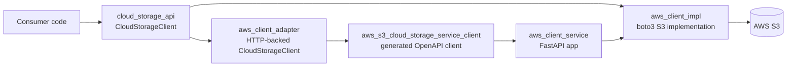
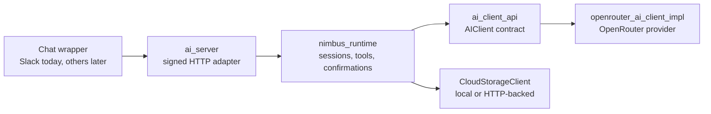

# Nimbus: Cloud Storage and AI Runtime

[](https://dl.circleci.com/status-badge/redirect/gh/ospsd-team-2/ospsd-team-2/tree/hw-3)
[](https://circleci.com/gh/ospsd-team-2/ospsd-team-2)
[](https://python.org)
[](https://github.com/astral-sh/ruff)

Nimbus is a Python 3.12+ workspace for building cloud-storage-backed AI
applications without coupling product code to one storage provider, one model
provider, or one chat frontend.

It exists to make this workflow boring and reusable:

1. Store and inspect objects through a provider-neutral `CloudStorageClient`.
2. Expose that storage contract over HTTP for other services.
3. Let an AI assistant use a small, guarded storage tool surface.
4. Serve chat frontends through a signed, idempotent HTTP API.
5. Keep the architecture easy to test, replace, and extend.

If you are new here, start with the quickstart below, then read
[Repository Roadmap](#repository-roadmap) to find the right package.

## Contents

- [Quickstart](#quickstart)
- [See It Work](#see-it-work)
- [Tiny Code Examples](#tiny-code-examples)
- [Repository Roadmap](#repository-roadmap)
- [Architecture](#architecture)
- [Installation and Builds](#installation-and-builds)
- [Run the App](#run-the-app)
- [Run the Docs](#run-the-docs)
- [Test and Quality Commands](#test-and-quality-commands)
- [Environment Variables](#environment-variables)
- [Deployment Notes](#deployment-notes)
- [Troubleshooting](#troubleshooting)

## Quickstart

```shell
git clone git@github.com:ospsd-team-2/ospsd-team-2.git
cd ospsd-team-2
uv sync --all-packages

uv run pytest src/ -q
uv run sphinx-build docs/source docs/build/html
```

Confirm all workspace packages import:

```shell
uv run python -c "import aws_client_impl, aws_client_service, aws_client_adapter, ai_client_api, openrouter_ai_client_impl, nimbus_runtime, ai_server; print('workspace ok')"
```

Run the local API shell with development secrets:

```shell
SESSION_SECRET_KEY=dev-session-secret \
API_KEY=dev-storage-api-key \
AI_SERVER_API_KEY=dev-ai-api-key \
AI_SERVER_SIGNING_SECRET=dev-wrapper-signing-secret \
uv run uvicorn aws_client_service.main:app --reload
```

Then check:

```shell
curl http://localhost:8000/health
curl http://localhost:8000/ai/health
```

## See It Work

Run the Nimbus CLI without storage tools:

```shell
export OPENROUTER_API_KEY="sk-or-v1-..."
uv run --package openrouter-ai-client-impl nimbus --no-tools
```

Example session:

```text
$ uv run --package openrouter-ai-client-impl nimbus --no-tools
Nimbus ready. Model: z-ai/glm-4.5-air:free
> Summarize this repo in one sentence.
Nimbus is a provider-neutral cloud storage and AI runtime workspace with an S3
implementation, FastAPI APIs, an OpenRouter client, and guarded storage tools.
> /status
session=default tools=disabled fallback=configured
```

The signed AI wrapper route can also be smoke-tested without hand-building HMAC
headers:

```shell
uv run python scripts/ai_server_wrapper_smoke.py \
  --base-url http://localhost:8000 \
  --signing-secret "$AI_SERVER_SIGNING_SECRET" \
  message-event \
  --workspace-id T123TEAM \
  --event-id smoke-001 \
  --channel-id C123CHAN \
  --message-ts 1713840000.123456 \
  --user-id U123USER \
  --text "Hello, Nimbus."
```

## Tiny Code Examples

Use storage through the provider-neutral contract:

```python
from pathlib import Path

from aws_client_impl import get_client_impl

storage = get_client_impl()
info = storage.upload_file(
    container="my-bucket",
    local_path=Path("report.txt"),
    remote_path="reports/report.txt",
)
print(info.object_name, info.size_bytes)
```

Use AI through the provider-neutral contract:

```python
from ai_client_api import Conversation
from openrouter_ai_client_impl import OpenRouterClient, OpenRouterConfig

client = OpenRouterClient(OpenRouterConfig.from_env())
conversation = Conversation(system="You are concise.")
conversation.add_user("What can Nimbus do?")

response = client.send_message(conversation)
print(response.text)
```

Call the HTTP-backed storage adapter when your code should talk to the service
instead of boto3 directly:

```python
from aws_client_adapter import get_client_impl

storage = get_client_impl()
for item in storage.list_files("my-bucket", prefix="reports/"):
    print(item.object_name)
```

## Repository Roadmap

| Path | What lives there | Start here when... |
| --- | --- | --- |
| `README.md` | Project overview and quickstart | You are orienting yourself |
| `AGENTS.md` | Engineering rules for agents and contributors | You are changing code or docs |
| `CONTRIBUTING.md` | Human contribution workflow and project habits | You are preparing a PR |
| `pyproject.toml` | Workspace, lint, type, test, and docs configuration | You need tooling truth |
| `main.py` | Small CLI demo entry point | You want the simplest executable path |
| `src/aws_client_impl/` | boto3-backed `CloudStorageClient` implementation | You are touching real S3 behavior |
| `src/aws_client_service/` | FastAPI storage app, auth, OpenAPI, `/ai` mount | You are changing HTTP storage behavior |
| `src/aws_client_adapter/` | HTTP-backed `CloudStorageClient` adapter | You need Python callers to use the service |
| `src/aws_s3_cloud_storage_service_client/` | Generated OpenAPI client | You changed service API shape |
| `src/ai_client_api/` | Provider-neutral AI contract | You are defining model-provider-independent behavior |
| `src/openrouter_ai_client_impl/` | OpenRouter client, Nimbus CLI, storage tools | You are changing provider calls or CLI behavior |
| `src/nimbus_runtime/` | Sessions, confirmations, attachments, tool policy | You are changing chat orchestration |
| `src/ai_server/` | Signed HTTP chat router | You are integrating Slack/wrapper-style frontends |
| `tests/` | Repo-level integration and e2e tests | Behavior spans packages |
| `test_support/` | Shared fakes and test helpers | You need deterministic storage fakes |
| `fuzz/` | Fuzz harnesses for untrusted parsing paths | You are hardening validation/state parsing |
| `scripts/` | Smoke, integration, OpenAPI, and e2e helpers | You need repeatable local workflows |
| `docs/source/` | Sphinx/MyST documentation source | You are updating developer docs |

Package-level READMEs go deeper:

| Package | Purpose | README |
| --- | --- | --- |
| `cloud_storage_api` | External provider-neutral storage contract | [external repo](https://github.com/2SpaceMasterRace/ospsd-cloud-storage) |
| `aws_client_impl` | boto3-backed S3 implementation | [README](src/aws_client_impl/README.md) |
| `aws_client_service` | FastAPI storage service, auth, docs mount, `/ai` mount | [README](src/aws_client_service/README.md) |
| `aws_s3_cloud_storage_service_client` | Generated OpenAPI client | [README](src/aws_s3_cloud_storage_service_client/README.md) |
| `aws_client_adapter` | HTTP-backed `CloudStorageClient` adapter | [README](src/aws_client_adapter/README.md) |
| `ai_client_api` | Provider-neutral AI client contract | [README](src/ai_client_api/README.md) |
| `openrouter_ai_client_impl` | OpenRouter client, cloud tools, Nimbus CLI | [README](src/openrouter_ai_client_impl/README.md) |
| `nimbus_runtime` | Shared chat/session/tool orchestration | [README](src/nimbus_runtime/README.md) |
| `ai_server` | FastAPI router for signed wrapper chat turns | [README](src/ai_server/README.md) |

## Architecture

Nimbus follows the homework architecture in two connected passes:

- HW2: make the storage library usable locally or remotely without changing
  caller code.
- HW3: add a provider-neutral AI layer, guarded storage tools, signed chat
  ingress, deployment readiness, and telemetry seams.





Design rules:

- Program to `CloudStorageClient`, not to S3.
- Program to `AIClient`, not to OpenRouter.
- Only `aws_client_impl` imports `boto3`.
- Generated client code is regenerated, not hand-edited.
- `ai_server` is a transport adapter; orchestration belongs in `nimbus_runtime`.
- Public behavior includes env vars, response shapes, errors, CLI output, and docs.

For the longer version, read [Architecture Overview](docs/source/architecture-overview.md).

## Setup and Auth Instructions

Local development uses environment variables. `credentials.env` is gitignored
and may be used for personal secrets, but deployed environments should use the
platform secret store.

Minimum storage-service auth:

```shell
export SESSION_SECRET_KEY="dev-session-secret"
export API_KEY="dev-storage-api-key"
```

Live S3 access:

```shell
export AWS_ACCESS_KEY_ID="..."
export AWS_SECRET_ACCESS_KEY="..."
export AWS_REGION="us-east-1"
export AWS_BUCKET_NAME="your-bucket"
```

AI and wrapper auth:

```shell
export OPENROUTER_API_KEY="sk-or-v1-..."
export AI_SERVER_API_KEY="dev-ai-management-key"
export AI_SERVER_SIGNING_SECRET="dev-wrapper-signing-secret"
export AI_SESSION_DIR="$(pwd)/.nimbus-dev/sessions"
```

Authentication surfaces:

| Surface | Mechanism | Used by |
| --- | --- | --- |
| Storage HTTP routes | `X-API-Key` or GitHub OAuth session | scripts, generated clients, browser exploration |
| `/ai/chat/turn` | HMAC headers built from `AI_SERVER_SIGNING_SECRET` | chat wrapper service |
| `/ai/sessions/...` | `X-API-Key: $AI_SERVER_API_KEY` | support/admin tooling |
| OpenRouter | `OPENROUTER_API_KEY` | model calls |
| AWS S3 | AWS environment credentials | storage backend |

## Installation and Builds

There is no separate `INSTALL` file. The canonical install and build commands
are here, in [AGENTS.md](AGENTS.md), and in [Developer Guide](docs/source/developer-guide.md).

Install everything:

```shell
uv sync --all-packages
```

Install docs tooling only as part of the workspace:

```shell
uv sync --all-packages --group docs
```

Build docs:

```shell
uv run sphinx-build docs/source docs/build/html
```

Regenerate the storage OpenAPI schema and generated client after HTTP API
changes:

```shell
./scripts/update_openapi_schema.sh
./scripts/generate_client.sh
```

## Run the App

```shell
export SESSION_SECRET_KEY="dev-session-secret"
export API_KEY="dev-storage-api-key"
export AI_SERVER_API_KEY="dev-ai-api-key"
export AI_SERVER_SIGNING_SECRET="dev-wrapper-signing-secret"
export AI_SESSION_DIR="$(pwd)/.nimbus-dev/sessions"

uv run uvicorn aws_client_service.main:app --reload
```

Storage smoke with live AWS credentials:

```shell
export AWS_ACCESS_KEY_ID="..."
export AWS_SECRET_ACCESS_KEY="..."
export AWS_REGION="us-east-1"
export AWS_BUCKET_NAME="your-bucket"

printf 'hello from Nimbus\n' > /tmp/nimbus.txt
curl -X POST "http://localhost:8000/files/$AWS_BUCKET_NAME/demo/nimbus.txt" \
  -H "X-API-Key: $API_KEY" \
  -F "file=@/tmp/nimbus.txt"
```

Nimbus CLI with storage tools:

```shell
export OPENROUTER_API_KEY="sk-or-v1-..."
export NIMBUS_CONTAINER="$AWS_BUCKET_NAME"
export NIMBUS_SAFE_ROOT="$(pwd)"

uv run --package openrouter-ai-client-impl nimbus
```

## Run the Docs

Build HTML:

```shell
uv run sphinx-build docs/source docs/build/html
open docs/build/html/index.html
```

Force a clean rebuild:

```shell
cd docs
make fresh-html
```

Run executable docs examples:

```shell
uv run sphinx-build -b doctest docs/source docs/build/doctest
```

Serve with autoreload:

```shell
cd docs
make serve
```

The FastAPI app serves built docs under `/guide/`:

```shell
uv run sphinx-build docs/source docs/build/html
SESSION_SECRET_KEY=dev-session-secret \
API_KEY=dev-storage-api-key \
AI_SERVER_API_KEY=dev-ai-api-key \
AI_SERVER_SIGNING_SECRET=dev-signing-secret \
uv run uvicorn aws_client_service.main:app --reload
```

Then open `http://localhost:8000/guide/`.

## Test and Quality Commands

```shell
uv run pytest
uv run pytest src/ -q
uv run pytest -m "unit or regression"
uv run pytest -m property
uv run pytest tests/integration/ -q
uv run pytest tests/e2e/ -m "not local_credentials" -v

uv run ruff check .
uv run ruff format --check .
uv run mypy --strict .
```

Package-focused commands:

```shell
uv run --package aws-client-impl pytest src/aws_client_impl/tests/ -q
uv run --package aws-client-service pytest src/aws_client_service/tests/ -q
uv run --package aws-client-adapter pytest src/aws_client_adapter/tests/ -q
uv run --package ai-client-api pytest src/ai_client_api/tests/ -q
uv run --package openrouter-ai-client-impl pytest src/openrouter_ai_client_impl/tests/ -q
uv run --package nimbus-runtime pytest src/nimbus_runtime/tests/ -q
uv run --package ai-server pytest src/ai_server/tests/ -q
```

Fuzz smoke mode:

```shell
PYTHONFUZZ_NO_ATHERIS=1 uv run python fuzz/fuzz_conversation.py
PYTHONFUZZ_NO_ATHERIS=1 uv run python fuzz/fuzz_session_id.py
PYTHONFUZZ_NO_ATHERIS=1 uv run python fuzz/fuzz_request_state.py
```

## Environment Variables

| Variable | Used by | Purpose |
| --- | --- | --- |
| `SESSION_SECRET_KEY` | `aws_client_service` | Starlette session cookie signing |
| `API_KEY` | storage service/adapter | Storage route shared secret |
| `AWS_ACCESS_KEY_ID`, `AWS_SECRET_ACCESS_KEY`, `AWS_REGION` | `aws_client_impl` | Live S3 access |
| `AWS_BUCKET_NAME` | demos, Nimbus tools | Default bucket/container |
| `CLOUD_STORAGE_SERVICE_BASE_URL` | `aws_client_adapter` | Storage service base URL |
| `OPENROUTER_API_KEY` | OpenRouter client, AI server | Live model calls |
| `OPENROUTER_MODEL`, `OPENROUTER_FALLBACK_MODEL` | OpenRouter client | Model selection |
| `AI_SERVER_API_KEY` | `ai_server` | Session history/delete auth |
| `AI_SERVER_SIGNING_SECRET` | `ai_server` | HMAC auth for `/ai/chat/turn` |
| `AI_SESSION_DIR` | `ai_server`, `nimbus_runtime` | Session and request-state directory |
| `NIMBUS_CONTAINER` | Nimbus tools | Pinned storage container |
| `NIMBUS_SAFE_ROOT` | Nimbus CLI tools | Local filesystem sandbox |

Never commit real secrets. `credentials.env` is gitignored for local use.

## Deployment Notes

The current deployment target is Fly.io. Session and request-state files need a
persistent volume:

```toml
[[mounts]]
  source      = "nimbus_sessions"
  destination = "/data"
```

Set `AI_SESSION_DIR=/data/sessions` in Fly secrets and keep at least one machine
running so the volume remains attached.

## Troubleshooting

| Symptom | Fix |
| --- | --- |
| `ModuleNotFoundError` for a workspace package | Run `uv sync --all-packages`. |
| `SESSION_SECRET_KEY` missing | Export it before importing/running `aws_client_service.main:app`. |
| Storage route returns `401` | Send `X-API-Key: $API_KEY` or complete OAuth. |
| `/ai/chat/turn` returns `401` | Check HMAC signature, timestamp freshness, and nonce reuse. |
| `/ai/chat/turn` returns `503` | Set `AI_SERVER_SIGNING_SECRET` and `OPENROUTER_API_KEY` as needed. |
| OpenRouter returns `401` | Check `OPENROUTER_API_KEY`. |
| S3 credentials fail | Check AWS env vars and IAM bucket permissions. |

## More Docs

- [Developer Guide](docs/source/developer-guide.md)
- [Design Document](DESIGN.md)
- [Cloud Storage](docs/source/cloud-storage/index.md)
- [Nimbus Runtime](docs/source/nimbus/index.md)
- [HTTP API Reference](docs/source/api.md)
- [Testing Guide](docs/source/testing.md)
- [Contributing](CONTRIBUTING.md)

## License

MIT. See `LICENSE`.
