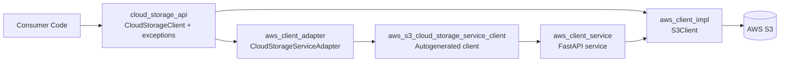
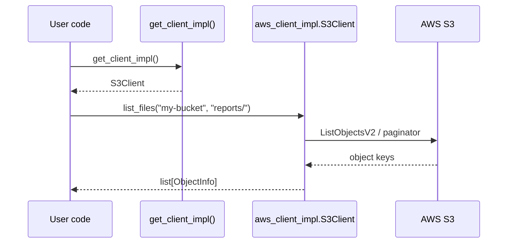
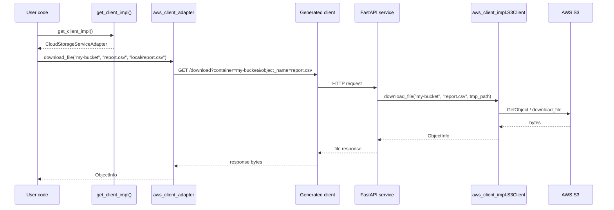

# Design Document

**Date:** 2026-04-01
**Status:** Current

## Overview

This repository started in HW1 as a local Python library: callers imported an
abstract `CloudStorageClient` contract and a concrete AWS S3 implementation was
registered via dependency injection. For HW2, that local-only design was turned
into a service-oriented architecture with three additional bridges:

1. `aws_client_service` exposes the existing S3 implementation over HTTP.
2. `aws_s3_cloud_storage_service_client` is autogenerated from `/openapi.json`.
3. `aws_client_adapter` wraps the autogenerated client and re-implements the
   original `CloudStorageClient` interface.

The result is location transparency: the consumer's code can stay the same
whether the storage logic runs in-process or behind a network boundary.

## Components

| Component | Role | Depends on |
|---|---|---|
| `cloud_storage_api` (external) | Abstract contract, domain types, and exceptions | nothing implementation-specific |
| `aws_client_impl` | Concrete S3 implementation using `boto3` | `cloud_storage_api`, `boto3` |
| `aws_client_service` | FastAPI deployment unit wrapping the impl | `aws_client_impl`, `cloud_storage_api` |
| `aws_s3_cloud_storage_service_client` | Autogenerated HTTP client from OpenAPI | `httpx`, `attrs` |
| `aws_client_adapter` | HTTP-backed adapter implementing `CloudStorageClient` | generated client, `cloud_storage_api` |

## Architecture Diagram



## Request Flow

### Local library path



### Remote service path



## Public Contract

`CloudStorageClient` is defined in the external `cloud_storage_api` package and
exposes container-scoped operations:

- `upload_file(container, local_path, remote_path) -> ObjectInfo`
- `upload_obj(container, file_obj, remote_path) -> ObjectInfo`
- `download_file(container, object_name, file_name) -> ObjectInfo`
- `list_files(container, prefix) -> list[ObjectInfo]`
- `delete_file(container, object_name) -> DeleteResult`
- `get_file_info(container, object_name) -> ObjectInfo`

Typed domain exceptions and return types (`ObjectInfo`, `DeleteResult`) are
provided by the external `cloud_storage_api` package.

## API Design

### HTTP endpoints

| Method | Path | Purpose | Success response |
|---|---|---|---|
| `GET` | `/health` | Operational health probe | `{"status": "ok"}` |
| `GET` | `/` | Simple root endpoint | `{"message": "Hello World"}` |
| `GET` | `/auth/login` | Start GitHub OAuth redirect | `302` redirect |
| `GET` | `/auth/callback` | Complete GitHub OAuth flow | `{"message": "OAuth login successful"}` |
| `POST` | `/files/{container}/{object_name}` | Upload an object | `ObjectInfoResponse` |
| `GET` | `/files?container=...&prefix=...` | List objects in a container | `list[ObjectInfoResponse]` |
| `GET` | `/download?container=...&object_name=...` | Download an object | file response |
| `DELETE` | `/files/{container}/{object_name}` | Delete an object | `DeleteResultResponse` |
| `GET` | `/files/{container}/{object_name}/info` | Get object metadata | `ObjectInfoResponse` |

### Sample API response

```json
{
  "files": [
    "reports/2026-03.csv",
    "reports/2026-04.csv"
  ]
}
```

## Error Handling

The service does not leak raw `boto3` or HTTP exceptions to callers.

### Local implementation translation

| S3 / boto3 condition | Domain exception |
|---|---|
| empty container | `InvalidContainerError` |
| empty key / leading slash | `InvalidObjectNameError` |
| invalid file object | `InvalidFileObjectError` |
| missing object / bucket 404 | `ObjectNotFoundError` |
| unexpected provider failure | `StorageBackendError` |

### Service translation

| Domain exception | HTTP status |
|---|---|
| `InvalidContainerError` | `400` |
| `InvalidObjectNameError` | `400` |
| `InvalidFileObjectError` | `400` |
| `ObjectNotFoundError` | `404` |
| `StorageBackendError` | `502` |

### Adapter translation

The adapter converts HTTP failures back into the same domain exceptions so
consumer code can handle local and remote backends uniformly.

## Why the Adapter Is Needed

The autogenerated client is intentionally low-level. Its methods mirror HTTP
operations (`upload_object_files_container_object_name_post.sync_detailed`,
etc.), return HTTP-oriented response objects, and expose transport details.

That does not match the HW1 interface contract. The adapter restores the
original abstraction by:

1. mapping generated-client methods to `CloudStorageClient` methods,
2. converting HTTP failures back into domain exceptions, and
3. hiding multipart/upload/download response details from callers.

### Local usage vs remote usage

Local library backend:

```python
from aws_client_impl.s3_client import get_client_impl

client = get_client_impl()
client.list_files("my-bucket", "reports/")
```

Remote service backend:

```python
from aws_client_adapter import get_client_impl

client = get_client_impl()
client.list_files("my-bucket", "reports/")
```

Only the factory import changes. The caller still talks to the same abstract API.

## Testing Strategy

| Layer | What it proves |
|---|---|
| Unit tests in `src/aws_client_impl/tests/` | S3 logic, validation, multipart behavior, error translation |
| Unit tests in `src/aws_client_service/aws_client_service/tests/` | HTTP status codes, factory wiring, temp-file cleanup, auth behavior |
| Unit tests in `src/aws_client_adapter/tests/` | HTTP-to-domain exception mapping and generated-client adaptation |
| Integration tests in `tests/integration/` | Factory wiring, adapter registration, adapter path through the real FastAPI app |
| E2E tests in `tests/e2e/` | OpenAPI surface and application entry-point behavior |

### Mocking strategy

- Unit tests mock only external boundaries: `boto3`, HTTP transport, or the
  generated client functions.
- Integration tests avoid mocking the whole system. The adapter integration test
  uses the real FastAPI app with a file-backed storage fake to exercise the full
  adapter -> generated client -> service path.

### Interface compliance

Interface compliance is verified in two ways:

1. both `S3Client` and `CloudStorageServiceAdapter` subclass
   `CloudStorageClient`, and
2. integration tests explicitly register each backend and verify that
   `get_client_impl()` returns a concrete implementation satisfying the shared
   contract.

## Key Decisions

### Keep `cloud_storage_api` as a clean external dependency

Reason: the abstract contract is an external package and must not be vendored
or modified locally.

### Make containers explicit on every object operation

Reason: the older contract mixed bucket-bound and per-call bucket semantics,
which made upload and list behave as if the bucket name were hardcoded. Making
the container explicit fixes that mismatch and makes local and remote behavior
consistent.

### Exclude autogenerated client code from strict lint/coverage gates

Reason: the generated client is a mechanical artifact, not hand-authored domain
logic. The homework's quality gates should measure authored code while still
keeping the generated package present and usable.
